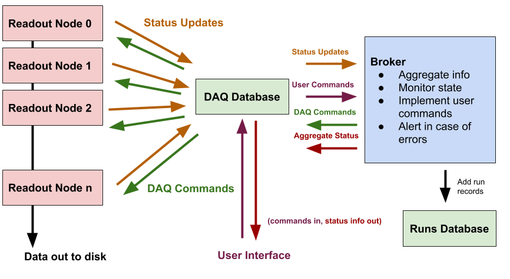

# redax Docs
D. Coderre, 3. January 2019

## Brief

Redax is a DAQ readout code based on CAEN electronics. It is designed to be used with V1724 digitizers
connected via their front optical ports to A3818 PCIe cards, but it can also be used for other similar
setups, for example with different digitizer models or configuration strategies (some modification 
could be required in some cases). Output is into the (strax)[https://github.com/axfoundation/strax] 
input format. This documentation should get you up and running with redax. At the 
time of writing the software is still in heavy development so if there are any issues with this 
documentation please file an issue on GitHub.

## Use Case

Redax is meant to be a full-scale DAQ solution facilitating readout of many channels in parallel. It is 
designed to be the production system for the XENONnT experiment. There is no 'standalone' or 'lite mode' 
included, so using this in a small-scale test setup could be overkill, since the system requires somewhat 
considerable infrastructure in order to function. However use in a long term, permanent lab setup, even 
if the number of channels is low, should be quite easy.

## Overview

This document provides setup steps in order, beginning with installation of prerequisites and ending in 
configuration of the final system. Use these links to navigate to the sub-pages.

  1. (Installation of prerequisites)[prerequisites.md]
  2. (Configuration of backend databases)[databases.md]
  3. (Installing software and helper programs)[installation.md]
  4. (DAQ Configuration options)[daq_options.md]
  5. (Examples of running the readout)[how_to_run.md]
  
A brief overview of the complete system follows. Please refer to Figure 1.

<strong>Figure 1: A diagram of the software components. Please refer to the text for details.</strong>
 

The system is based around a central MongoDB database (green box "DAQ Database" in the middle) containing several
subcollections and facilitating communcation between each component. Each readout node (red boxes on left) is 
an independent process responsible for readout of a certain number of channels on one or more PCI card optical links, 
where each link can support up to 8 daisy-chained digitizers or, if a slower readout speed can be tolerated, en 
entire crate full of digitizers connected via a V2718 crate controller. 

The readout nodes are constantly polling the database looking for new commands addressed to them. Commands are 
limited to **arm**, **start** (always in conjunction) and **stop**. Additionally the readout nodes report their
status to the database, including their readout state (i.e. **idle** or **running**), current rate, buffered data 
size, and current settings. From the standpoint of a readout node, data acquisition can only be initiated when it 
is in the **idle** state. It can then receive a command to **arm** acquisition, which also provides the name of the
settings document to be used for this run. The settings document is retrieved from the database and the readout code is
configured with these settings. If the configuration is successful the digitizer reports itself in **armed** state and 
is then receptive to the **start** command. Upon starting acquisition the digitizer proceeds to read data and write
it to the location specified in the settings file. Acquisition is stopped when a **stop** command is read from the 
database. At this point the digitizer finishes reading the last data from the digitizer buffers, finishes writing data
from its own internal buffers, frees all reserved memory, resets all objects, and returns to the **idle** state, 
at which point it is ready for further acquisition.

In a full-scale system, the **arm**, **start**, and **stop** commands do not come to the readout process
directly from the user but via the **broker** (blue box on the right in figure 1). However it should be noted 
that in small-scale lab-sized systems the broker can be omitted, or greatly simplified and the user could control a 
single readout process directly. In the case of the full-scale system, however, several readout processes must be operated
in parallel and kept in synchronization. This is facilitated by the broker. The broker reads a **state document** set by
the user that defines one or more **detectors** to operate in parallel. This document also defines what each detector should
be doing (running or not), in what operational mode, and a few other parameters such as the length of runs. The dispatcher
then reads the status of all readout nodes and performs a logic similar to the following:

  1. Is the system already in the desired state? (if so do nothing)
  2. If not, do I have all the proper components and are they all in **idle** mode such that I can put them into the desired state?
  3. If I have all the components to implement the user's goal state then issue commands to do so
  4. If I don't have all the components to implement the user's goal state report this to the user

The broker then continues to monitor the state document for changes and implements them as appropriate. It also reports 
aggregate information back to the database for display in the frontend. The idea of this is that the user can set something
like "run the TPC in background mode with 60 minute runs" and the broker will make sure this happens for an unlimited
amount of time, until the desired state command changes.

The user interface is left blank here. It should consist of at least functionality to display the current state of the 
DAQ as well as to control the **state documents** read by the broker. An example implementation of a nodejs web frontend
is found [here](https://github.com/coderdj/nodiaq). 

